# Latest Receipt Scanning Software Roundup (Including Detailed Reviews)

Managing shoebox receipts and tracking business expenses used to mean endless hours of manual data entry, crumpled papers stuffed in drawers, and that sinking feeling when tax season rolled around. Modern receipt scanning software changed that completely—snap a photo with your phone, let OCR technology extract the data, and watch your expenses automatically categorize themselves into accounting software. Whether you're a freelancer tracking deductibles, a small business managing team expenses, or an accounting firm handling multiple clients, these platforms eliminate the paper chase while keeping everything IRS-compliant and audit-ready.

This guide covers 10 proven receipt management solutions that handle everything from basic mobile scanning to enterprise-grade expense automation with multi-currency support and advanced approval workflows. You'll discover which tools offer the best OCR accuracy, where to find unlimited storage without monthly limits, and how quickly you can integrate with QuickBooks, Xero, or your existing accounting stack.

***

## **[Shoeboxed](https://www.shoeboxed.com)**

Receipt scanner combining mobile app scanning with unique mail-in service for physical documents.

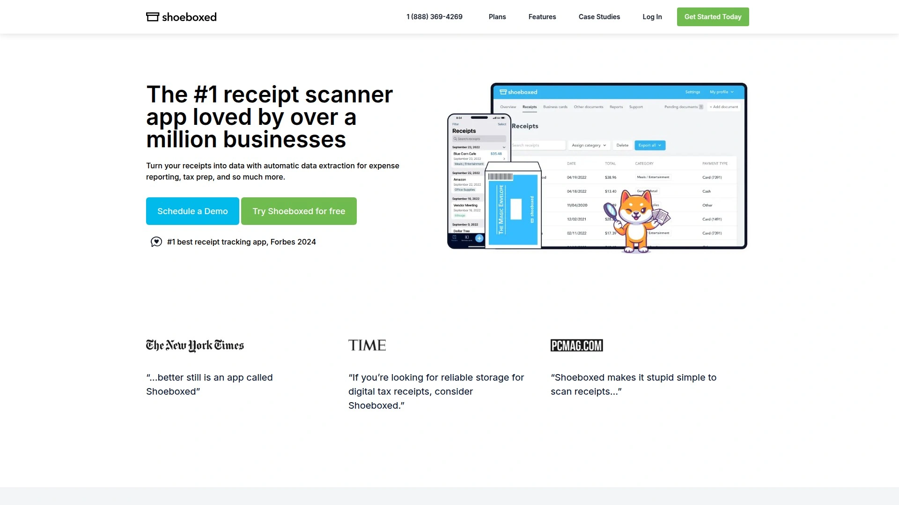

Shoeboxed has been transforming paper clutter into organized digital data since 2007, serving over 1 million accounts across 100 countries. The platform offers two distinct methods for digitizing receipts—snap photos using the mobile app for on-the-go capture, or mail physical receipts in prepaid Magic Envelopes for professional processing. This dual approach makes Shoeboxed uniquely flexible for users managing both digital and physical receipt workflows simultaneously.

The mail-in service stands out as Shoeboxed's signature feature. Send your pile of receipts, business cards, bills, and other documents in a postage-prepaid envelope, and the team carefully scans everything into your secure online account. Human verification teams review every scanned document, ensuring the OCR-extracted data meets IRS acceptance standards for tax audits. This combination of technology and human oversight delivers accuracy levels that purely automated systems struggle to match.

**Core capabilities include:** Unlimited cloud storage for all document types, unlimited users on every plan, free mileage tracking for iOS and Android, automatic currency conversion for international expenses, and customizable category tags with smart rules. The platform integrates directly with QuickBooks Online, Wave, Xero, and exports to Excel for users preferring manual accounting workflows. All data receives bank-level SSL encryption protection with 24/7 monitoring at processing facilities.

Pricing starts at $18 monthly for the Startup plan covering freelancers and solopreneurs, scaling to $47 monthly for Professional tier and $71 monthly for Business plans handling higher document volumes. Annual billing provides a significant discount. The Startup plan includes one Magic Envelope monthly with 50 digital uploads and 25 physical document submissions. Professional and Business tiers offer unlimited prepaid envelopes and free return shipping for processed documents.

Shoeboxed works particularly well for small business owners drowning in physical receipts who lack time for manual scanning, bookkeepers managing multiple client accounts, and anyone needing IRS-compliant digital records without purchasing expensive scanning equipment. The human verification layer provides peace of mind for tax preparation that pure OCR automation cannot guarantee.

***

## **[Expensify](https://www.expensify.com)**

Comprehensive expense management platform with SmartScan technology and automatic receipt matching.

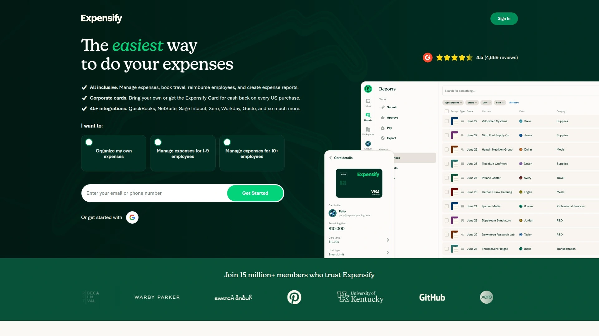

Expensify operates as a full-featured expense management solution combining receipt scanning with travel booking, corporate card management, and automated approval workflows. SmartScan technology captures receipt data through multiple channels—snap photos with the mobile app, forward receipt emails, or even text receipts via SMS. This multi-channel flexibility ensures no receipt gets lost regardless of how you receive it, making capture frictionless for employees constantly on the move.

The platform's automatic credit card transaction matching represents a game-changer for expense tracking. Import transactions from connected bank accounts and credit cards, then watch Expensify automatically pair them with corresponding receipt images. This eliminates duplicate entry and ensures complete expense documentation without manual crosschecking. The system recognizes over 150 currencies, automatically converting international purchases to home currency for accurate reporting.

Real-time expense reports generate automatically as receipts get captured, with intelligent categorization applying your company's expense policies. Multi-level approval workflows route submissions to appropriate managers based on amount thresholds and spend categories. Integration with major accounting platforms including QuickBooks, Xero, Sage, NetSuite, and SAP streamlines month-end closing by automatically syncing approved expenses.

**Free individual plan** covers personal expense tracking with unlimited SmartScans, bill payment, and invoice sending. Team plans start at $5 per user monthly, scaling to $9 monthly for corporate features and custom enterprise pricing for organizations requiring dedicated support. The Collect plan at $9 monthly adds advanced features like multi-level approvals, custom expense rules, corporate card reconciliation, and priority support.

Expensify targets businesses of all sizes but shines brightest for companies with 10-500 employees needing robust expense policies without enterprise-grade complexity. The platform works exceptionally well for organizations with frequent business travel, distributed teams submitting expenses remotely, and finance teams wanting to automate approval workflows while maintaining spending controls.

***

## **[Dext Prepare](https://dext.com)**

Bookkeeper-focused platform delivering 99%+ OCR accuracy with seamless accounting software integration.

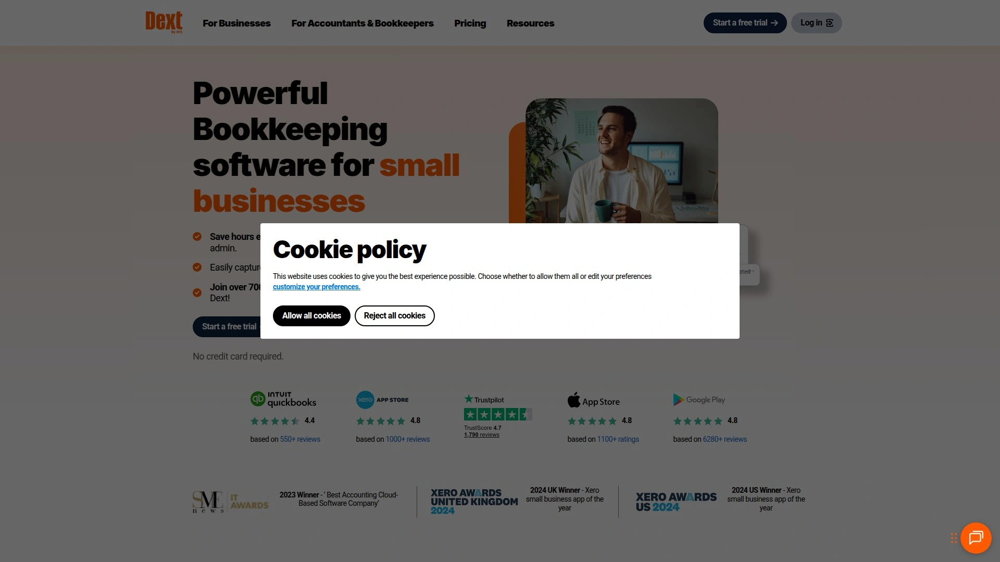

Dext Prepare (formerly Receipt Bank) specializes in serving accountants, bookkeepers, and their small business clients with receipt and invoice automation designed specifically for accounting workflows. The platform's AI-powered OCR technology achieves over 99% data extraction accuracy, capturing everything from transaction dates and amounts to supplier details, tax information, invoice numbers, and line-item details. This exceptional accuracy reduces manual correction time that plagued earlier generation scanning tools.

The mobile app lets clients snap photos of receipts and invoices instantly, with documents automatically uploading when internet connectivity returns if captured offline. Email forwarding provides an alternative submission method—forward any receipt or invoice email to your dedicated Dext address and the system processes it automatically. This multi-channel approach accommodates different user preferences and business workflows without forcing everyone into the same capture method.

**Accounting integration depth** sets Dext apart from generalist expense tools. Deep connections with Xero, QuickBooks, Sage, FreeAgent, and dozens of other platforms mean extracted data flows directly into the correct accounts with proper coding. The system learns your categorization preferences over time, suggesting appropriate GL codes and expense categories to accelerate processing. Documents store securely in Dext Vault for 10 years with bank-level encryption, meeting tax authority requirements for digital financial record retention.

Pricing operates on tiered subscription models based on monthly document volume and user count, with custom quotes provided based on specific business needs. The platform offers 14-day free trials letting prospective users test full functionality before committing. Volume discounts benefit accounting firms managing multiple client accounts under practice licenses.

Dext Prepare works best for accounting and bookkeeping firms serving small business clients, growing businesses already using major accounting software platforms, and organizations prioritizing OCR accuracy over all other factors. The bookkeeper-centric design makes it less suitable for companies wanting comprehensive T&E management or corporate card programs, but unbeatable for pure receipt-to-books automation.

***

## **[Veryfi](https://www.veryfi.com)**

API-first receipt OCR platform with developer-friendly tools and white-label capabilities.

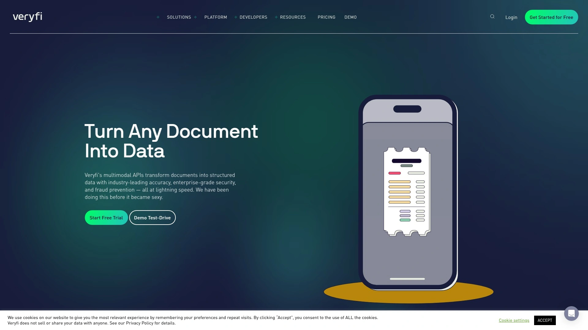

Veryfi approaches receipt scanning from a technology-first perspective, providing robust OCR APIs that developers and businesses integrate into existing applications. While Veryfi offers standalone mobile apps and web interfaces, the real power lies in its API infrastructure enabling companies to build custom expense solutions without developing OCR technology from scratch. The platform processes receipts, invoices, bills, purchase orders, and other financial documents with high accuracy across multiple languages.

Real-time processing delivers extracted data in seconds rather than minutes, with webhook notifications alerting systems immediately when documents finish processing. The API handles various image formats and qualities gracefully, applying automatic perspective correction, noise reduction, and contrast enhancement before OCR analysis. Line-item extraction captures individual purchase details beyond header information, valuable for detailed spend analysis and inventory tracking.

**White-label capabilities** let businesses brand the receipt capture experience as their own, maintaining consistent user interfaces across their ecosystem. Veryfi's SDK integrations support iOS, Android, React Native, Flutter, and web platforms, covering virtually every mobile development environment. The platform includes fraud detection algorithms identifying duplicate submissions and suspicious document modifications that could indicate expense fraud.

Security and compliance receive significant attention with SOC 2 Type II certification, GDPR compliance, and PCI DSS adherence for payment card data handling. Documents process in regional data centers ensuring compliance with data residency requirements. The platform supports zero-knowledge encryption where Veryfi never sees unencrypted document content if customers choose to implement that security level.

Pricing follows usage-based models charging per document processed, with volume discounts for high-throughput customers. Free tiers provide limited monthly processing for testing and small-scale implementations. Enterprise plans include SLA guarantees, priority support, and custom deployment options including on-premise installations for organizations with strict data control requirements.

Veryfi suits software companies building expense features into their products, enterprises developing custom internal expense tools, and technology-forward businesses wanting API control over their document processing workflows. The developer-centric approach makes it less ideal for non-technical small businesses seeking turnkey expense management.

***

## **[Ramp](https://ramp.com)**

AI-powered spend management combining corporate cards, expense automation, and real-time controls.

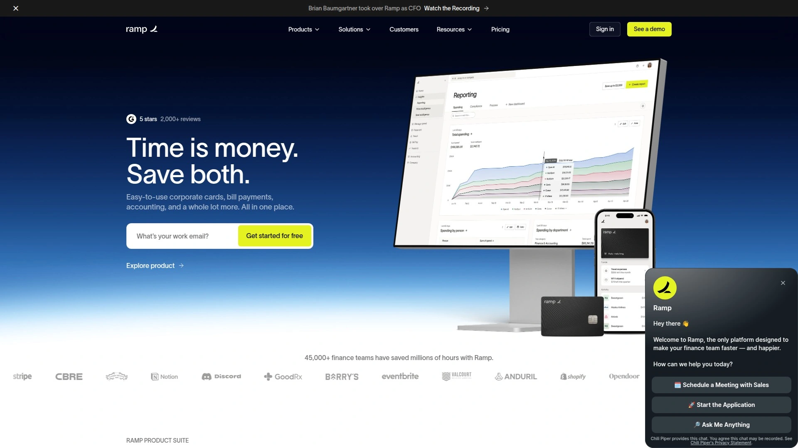

Ramp integrates expense management directly with corporate card issuance, creating a unified spend platform where every transaction automatically connects to its purpose and supporting documentation. When employees make purchases with Ramp cards, the system instantly prompts for receipt uploads via SMS or mobile app, matching transactions to documentation in real-time rather than waiting for month-end reconciliation. This immediacy dramatically reduces missing receipt headaches that plague traditional corporate card programs.

Built-in spending controls prevent out-of-policy purchases before they happen through card-level restrictions. Set precise limits by merchant category, specific vendors, transaction amounts, or time periods for each employee. Need to restrict software subscriptions to approved vendors only? Block restaurant spending after certain hours? Ramp enforces these rules automatically at the point of sale, declining transactions that violate policy instead of discovering problems during expense report reviews weeks later.

**AI-powered automation** handles receipt matching using OCR and machine learning to extract merchant details, amounts, dates, and tax information automatically. The system applies accounting codes based on predefined rules, routing expenses to correct departments and GL accounts without manual intervention. Approval workflows trigger based on configurable thresholds and categories, with managers reviewing and approving from email or mobile devices in minutes.

Real-time spend visibility provides finance teams complete transparency into company spending as it happens rather than retrospectively. Dashboards aggregate spending by department, category, vendor, or custom dimensions, with automated alerts flagging unusual patterns or policy violations. The platform integrates with major accounting systems including QuickBooks, Xero, NetSuite, and Sage, syncing transaction data and receipt images automatically.

Ramp charges no monthly fees or transaction fees on its corporate card program, earning revenue from interchange rather than subscription fees. The expense management and automation features come included without additional per-user charges. This pricing model makes Ramp attractive for growing companies tired of paying per-seat expense tool subscriptions that scale expensively with headcount.

The platform targets venture-backed startups, fast-growing mid-market companies, and any organization wanting to shift from reactive expense management to proactive spending controls. Ramp works particularly well for tech companies comfortable with modern cloud software and businesses seeking to eliminate traditional corporate card hassles.

***

## **[FreshBooks](https://www.freshbooks.com)**

All-in-one accounting platform including receipt scanning alongside invoicing and time tracking.

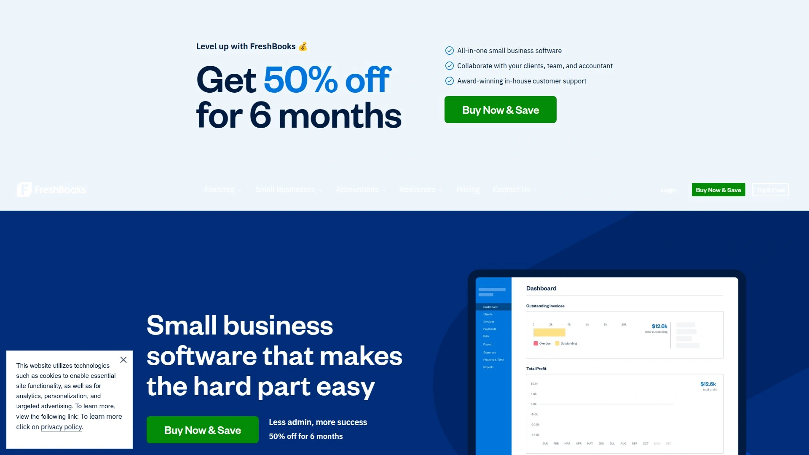

FreshBooks operates primarily as a comprehensive accounting solution for small businesses and freelancers, with receipt scanning integrated as one component of broader financial management capabilities. The platform combines invoicing, payment processing, time tracking, project management, and expense tracking into a unified environment, eliminating the need for multiple disconnected tools. This integration provides context that standalone receipt scanners cannot match.

Receipt capture happens through the mobile app's camera, file uploads from computers, or email forwarding to a dedicated FreshBooks address. The OCR engine automatically extracts merchant names, transaction amounts, dates, and tax details, creating expense records awaiting categorization and approval. Auto-categorization learns from your past entries, suggesting appropriate expense categories to accelerate processing without manual lookups.

**Bulk export functionality** generates expense reports in multiple formats for simplified tax filing, client billing, and internal budgeting. Connect business credit cards and bank accounts to import transactions automatically, then match them with receipt images to complete documentation. The system tracks billable versus non-billable expenses, letting service businesses accurately invoice clients for project-related costs backed by receipt documentation.

Integration with tax preparation software and accountant access features make year-end filing straightforward. Share read-only access with CPAs or bookkeepers so they review organized expenses without requiring separate document transfers. FreshBooks stores receipts securely with unlimited storage on all plans, ensuring historical records remain accessible for tax audits occurring years after original transactions.

Pricing starts at $19 monthly for the Lite plan supporting 5 billable clients, scaling through Plus at $33 monthly and Premium at $60 monthly for businesses requiring additional client capacity and features. Annual billing provides two months free. All plans include receipt scanning, mileage tracking, expense categorization, and basic reporting. Higher tiers add team member access, proposal creation, and advanced reporting capabilities.

FreshBooks works best for service-based businesses including consultants, designers, lawyers, and agencies that need both expense tracking and client invoicing capabilities. The all-in-one approach benefits businesses wanting to consolidate multiple tools into a single platform, though dedicated expense management specialists may offer more sophisticated features for large teams.

***

## **[QuickBooks Online](https://quickbooks.intuit.com)**

Industry-standard accounting software with built-in receipt capture and expense categorization.

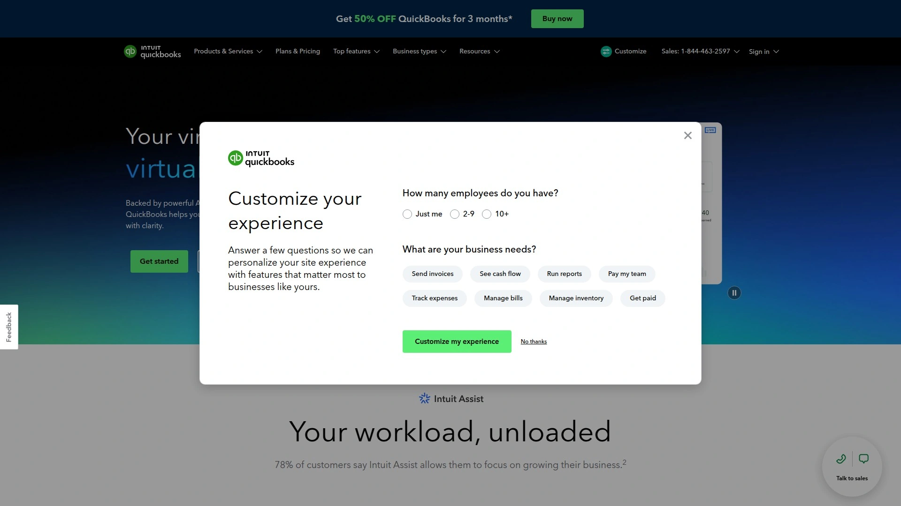

QuickBooks Online dominates small business accounting with comprehensive financial management features including receipt scanning as part of broader bookkeeping functionality. The platform's receipt capture integrates directly with general ledger transactions, bank reconciliations, and financial reporting, providing the tightest possible connection between expense documentation and actual accounting records. This integration eliminates the export/import dance required when using standalone receipt scanners with accounting software.

Snap photos of receipts using the QuickBooks mobile app and watch the OCR automatically extract amounts, dates, vendors, and payment methods. The system matches receipt images to existing bank transactions when possible, or creates new expense records for cash purchases and unrecorded transactions. Receipt images attach directly to transactions in your books, maintaining the audit trail required for tax compliance.

**Automatic categorization** applies expense categories based on vendor names and historical patterns, with suggestions improving over time as the system learns your business. Assign expenses to customers, projects, classes, or locations for detailed profitability tracking and client billing. The platform handles multiple currencies automatically, converting foreign transactions to home currency using daily exchange rates.

Mileage tracking integrates with receipt capture through the mobile app, automatically calculating deductible amounts based on IRS rates. Connect bank accounts, credit cards, PayPal, and other financial accounts to import transactions automatically, then match imported transactions with receipt images to complete documentation. The system identifies duplicate transactions, preventing double-counting when the same expense appears from multiple sources.

Pricing starts at $35 monthly for Simple Start covering basic invoicing and expense tracking, scaling through Essentials at $65 monthly and Plus at $99 monthly for additional users and features. Advanced tier runs $235 monthly with dedicated support and advanced reporting. All plans include unlimited receipt uploads, basic categorization, and mobile app access.

QuickBooks works best for established small businesses already committed to QuickBooks for accounting who want receipt capture integrated directly into their books without additional software. The platform's market dominance means most accountants know QuickBooks intimately, simplifying year-end collaboration and tax preparation.

***

## **[Fyle](https://www.fylehq.com)**

Text-based expense submission system with conversational AI and real-time policy enforcement.

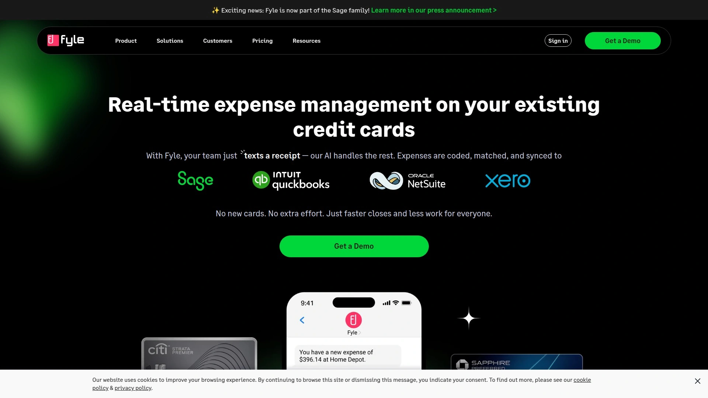

Fyle differentiates itself through a text message-based expense submission interface alongside traditional mobile app and email capture methods. Employees text receipt photos or forward emails to Fyle, which responds with extracted data and categorization suggestions, creating a conversational expense submission experience. This approach removes friction for users uncomfortable with dedicated apps or formal expense systems, particularly valuable for hourly workers and field employees.

The platform enforces expense policies in real-time during submission rather than after-the-fact during approval reviews. Employees receive immediate feedback when expenses violate company policies—over budget limits, wrong expense categories, missing required approvals, or policy-violating merchants. This instant notification lets employees correct issues immediately rather than discovering problems during month-end reconciliation, reducing approval cycles and policy violations.

**Microsoft and Google integration** runs deep with native apps for Outlook, Gmail, Teams, and Slack. Submit expenses directly from email interfaces without switching applications, matching receipts to calendar events automatically for streamlined business travel documentation. Fyle syncs with Active Directory and Google Workspace for automatic user provisioning as employees join or leave organizations.

Corporate card reconciliation connects to all major card providers, automatically matching transactions with submitted receipts and flagging unmatched purchases requiring documentation. Approval workflows route to appropriate managers based on configurable rules covering amounts, categories, departments, and custom fields. Analytics dashboards provide spending visibility across dimensions including departments, projects, merchants, and employees.

Pricing follows per-active-user models starting around $7 monthly per user submitting expenses, with enterprise pricing available for larger organizations requiring custom features, integrations, or SLA commitments. The platform offers free trials and demo environments for testing before full deployment.

Fyle suits modern, distributed organizations with employees comfortable using text messaging and conversational interfaces. Companies prioritizing real-time policy enforcement over post-submission auditing benefit from Fyle's approach, though traditional corporate environments may prefer conventional expense systems with familiar interfaces.

***

## **[Zoho Expense](https://www.zoho.com/expense/)**

Budget-friendly expense tracker with strong mobile capabilities and Zoho ecosystem integration.

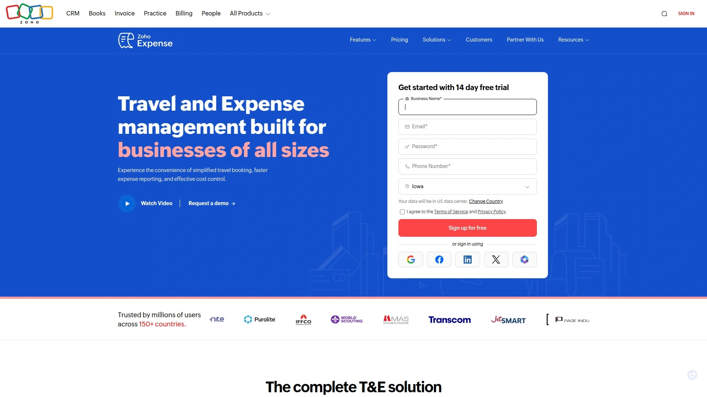

Zoho Expense operates as part of the broader Zoho business application ecosystem, providing natural integration points for companies already using Zoho Books, Zoho CRM, Zoho Projects, or other Zoho products. The platform combines receipt scanning, mileage tracking, expense reporting, and approval workflows at price points significantly below competitors—a major advantage for budget-conscious businesses needing comprehensive features without premium pricing.

Receipt capture works through the mobile app, email forwarding, or browser uploads, with OCR automatically extracting merchant, amount, date, and currency details. The system supports over 150 currencies with automatic conversion to home currency using current exchange rates. Auto-scan technology processes receipts in bulk, valuable when catching up on backlogged expenses or onboarding historical data.

**Mileage tracking** uses GPS to automatically log business trips, calculating reimbursable amounts based on configurable rates matching IRS standards or company-specific policies. Set per diem rates for different locations and trip types, automatically applying appropriate amounts based on travel dates and destinations. The platform enforces spending limits by category, project, or trip, preventing employees from exceeding approved budgets.

Multi-level approval workflows route expense reports through appropriate chains of command based on report amounts, expense types, or organizational hierarchies. Approvers review reports from desktop or mobile interfaces, with one-click approval for compliant submissions or line-by-line commenting for items requiring clarification. Integration with Zoho Books automatically creates vendor bills and journal entries for approved expenses, maintaining tight synchronization between expense management and accounting.

Pricing starts at $3 per user monthly for the Standard plan covering basic features, scaling to $5 monthly for Premium tier adding advanced features and higher automation limits. Enterprise plans provide custom pricing for organizations requiring additional customization, integrations, or support. Free trials let businesses test full functionality before committing.

Zoho Expense works best for existing Zoho ecosystem users wanting unified business applications, budget-conscious organizations prioritizing value over premium features, and small businesses seeking straightforward expense management without unnecessary complexity. The affordable pricing makes it accessible for startups and bootstrapped companies that competitors' pricing puts out of reach.

***

## **[WellyBox](https://wellybox.com)**

Web-centric receipt tracker with WhatsApp integration and automatic email receipt capture.

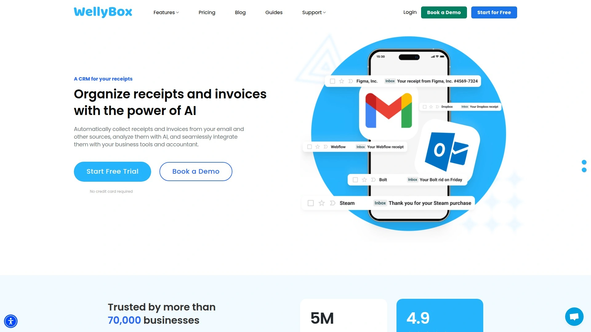

WellyBox takes a unique approach to receipt management by automatically scanning email inboxes and extracting receipt attachments from e-commerce purchases, subscription services, and digital merchants. Connect your email accounts and WellyBox continuously monitors for incoming receipts, automatically importing and categorizing them without manual intervention. This hands-off approach works brilliantly for businesses with significant online spending where receipts arrive via email rather than as physical documents.

WhatsApp integration provides an alternative submission method particularly valuable in regions where WhatsApp dominates business communications. Forward receipt photos directly via WhatsApp and WellyBox processes them automatically, adding captured expenses to your dashboard within minutes. This mobile-first capture method removes friction for users who live in messaging apps rather than formal business applications.

**Customizable categorization rules** learn from your expense patterns, automatically assigning categories, projects, and tags based on merchant names and historical classifications. Set up rules once and watch WellyBox apply them consistently to every incoming receipt, eliminating repetitive manual categorization work. The platform generates expense reports automatically, exporting to Excel, PDF, or directly into accounting software.

The web-based interface emphasizes simplicity and speed over comprehensive feature depth. Navigate expenses by date, category, merchant, or project with straightforward filtering and search. WellyBox works best for businesses with relatively straightforward expense needs rather than organizations requiring complex approval workflows, corporate card integration, or advanced policy enforcement.

Pricing starts at $9 monthly for the Basic plan supporting one email connection and limited monthly receipts, scaling to $49 monthly for Company plans handling multiple users and higher volumes. Accountant plans at $99 monthly serve bookkeepers managing multiple client accounts. All plans include email synchronization, WhatsApp integration, and basic reporting capabilities.

WellyBox suits digital-first businesses making most purchases online, companies operating in WhatsApp-heavy markets, and solopreneurs wanting automatic receipt capture without proactive scanning. The automatic email monitoring eliminates capture work entirely for qualifying expenses, though businesses with significant physical receipt volumes still need complementary mobile scanning capabilities.

***

## **[Wave](https://www.waveapps.com)**

Completely free accounting software including receipt scanning for small businesses and freelancers.

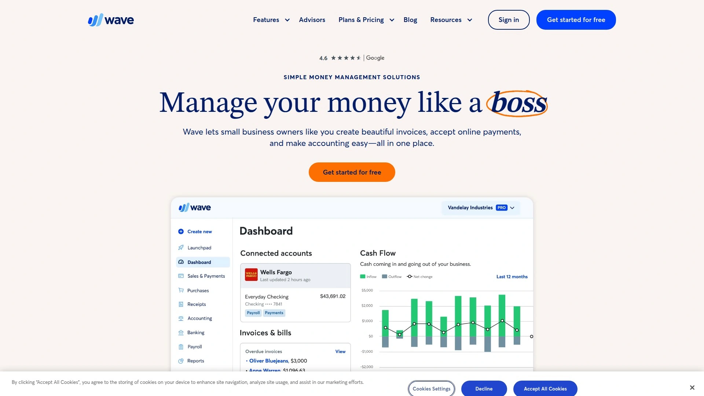

Wave provides comprehensive accounting functionality at zero subscription cost, monetizing instead through payment processing fees when customers use Wave Payments for invoicing. The free model includes receipt scanning, invoicing, accounting, and basic reporting—features competitors charge monthly subscriptions to access. This makes Wave uniquely accessible for bootstrapped startups, side hustles, and freelancers operating on minimal budgets who still need professional financial management.

Receipt scanning works through the Wave mobile app, letting users snap photos and upload receipts directly into their accounting system. The OCR extracts merchant names, amounts, and dates, creating transactions that populate directly in the general ledger. Users categorize expenses into appropriate accounts, with Wave learning preferred categories over time to automate future classifications.

**Bank connections** import transactions automatically from connected accounts, with receipt images attaching to imported transactions to complete documentation. The system helps match receipts to bank transactions, maintaining clean books where every expense includes supporting documentation. Wave handles multiple currencies, converting foreign transactions to home currency for accurate reporting.

Mileage tracking integrates with the mobile app, calculating deductible amounts based on distance traveled. Financial reports including profit and loss statements, balance sheets, and cash flow reports generate automatically from entered transactions and uploaded receipts. Wave's double-entry accounting ensures financial accuracy that casual expense trackers cannot provide.

The completely free model eliminates subscription costs, though businesses using Wave Payments for credit card or bank transfer processing pay competitive per-transaction fees. Premium support adds $20 monthly for users wanting priority assistance, though community forums and help documentation cover most common questions.

Wave works best for sole proprietors, freelancers, and micro-businesses under $250K annual revenue where subscription costs materially impact profitability. The zero-cost model makes it risk-free to start, though businesses outgrowing Wave's feature set eventually migrate to platforms offering more sophisticated expense management, inventory tracking, or multi-user capabilities.

***

## FAQ

**How does receipt scanning accuracy compare between human verification and pure OCR?**

Shoeboxed's human verification process reviews every OCR-scanned receipt, catching errors and ensuring IRS compliance that pure automation misses. Automated systems like Expensify and Dext Prepare achieve 95-99% accuracy through advanced AI, sufficient for most business purposes but occasionally requiring manual corrections for challenging receipts with poor image quality or unusual formats. Human verification adds processing time—typically 24-48 hours versus instant for automated OCR—but guarantees audit-ready accuracy that automated systems approach but rarely perfect. Most businesses find modern automated OCR accurate enough for daily use, reserving human verification services for critical tax documentation or high-stakes compliance situations.

**Can I use receipt scanning apps if my accounting is already handled by QuickBooks or Xero?**

Yes, most receipt scanners integrate directly with major accounting platforms including QuickBooks, Xero, Sage, NetSuite, and FreshBooks. Shoeboxed, Dext Prepare, and Expensify all export transaction data and receipt images directly into connected accounting software, eliminating manual entry. The integration creates expense transactions in your books with receipt documentation attached, maintaining proper audit trails. Some businesses prefer using receipt capture features built directly into accounting software like QuickBooks Online or FreshBooks to avoid managing separate tools, while others choose specialized receipt scanners offering superior OCR accuracy, mobile experiences, or mail-in processing services that accounting software doesn't provide.

**What's the difference between mileage tracking apps and receipt scanning apps?**

Receipt scanning apps focus primarily on capturing and digitizing expense documentation from purchases, while mileage tracking apps use GPS to automatically log business trips and calculate deductible amounts. Shoeboxed, FreshBooks, and Zoho Expense include both capabilities in single platforms, eliminating the need for separate tools. Standalone mileage trackers like MileIQ or Everlance often provide more sophisticated trip classification, automatic detection, and detailed route mapping than receipt scanners' basic mileage features. For businesses with significant business travel and vehicle expenses, dedicated mileage trackers combined with receipt scanners often deliver better results than all-in-one tools trying to handle both adequately but mastering neither.

---

## Conclusion

Choosing the right receipt scanning solution depends on your specific workflow—whether you need mail-in processing for physical document backlogs, real-time corporate card integration, or simply the most affordable way to digitize receipts for tax time. Most platforms offer free trials letting you test OCR accuracy, mobile app usability, and accounting software integration with your actual receipts before committing to subscriptions. The receipt scanning market has matured significantly, giving you solid options across every budget level from completely free tools to enterprise-grade automation platforms.

For small businesses and freelancers seeking the best balance of automated scanning and human verification accuracy, **[Shoeboxed](https://www.shoeboxed.com)** delivers the most comprehensive solution with its unique combination of mobile app OCR, mail-in Magic Envelope service, and unlimited cloud storage. The platform's human data verification ensures IRS-compliant digital records suitable for tax audits while unlimited users make it particularly cost-effective for growing teams managing expense documentation across departments without per-seat pricing escalating costs as headcount increases.
